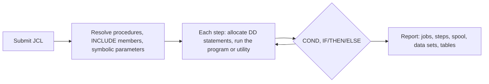

Harwell runs batch work as JCL jobs. You submit JCL against your program libraries, catalog and Db2 tables. Harwell runs each step and returns the job log, the return codes, the spool output and the changed data sets and tables, in the same form that z/OS produces them.

**Topics**

- [Codebase](#codebase)
- [Data](#data)
- [How a job runs](#how-a-job-runs)
- [Output](#output)
- [Submit a batch job](#submit-a-batch-job)

## Codebase

Harwell runs a codebase in place. The `harwell.toml` file at its root declares the libraries, the JOB card, the options and the Db2 catalog. Harwell finds each member by member name through the search orders that you declare, in the same way as STEPLIB and SYSLIB concatenations:

| Key | Finds |
| --- | --- |
| `procedure_order` | The JCL that you submit, and each cataloged procedure that it calls |
| `search_order` | The program of each step, and each program that it calls. Earlier libraries take precedence |
| `copybook_order` | COPY members |
| `system_library` | Site services and load libraries, by data set name |

Harwell resolves every setting that can change output once per run. The report records each setting and its source in `configuration`. Two runs used the same configuration if their `configuration.values` are equal.

## Data

| Data | Source |
| --- | --- |
| Data sets | One file per data set name, with its LRECL and RECFM. Fixed-length records contain no line separators |
| Db2 tables | The DDL and seed members listed in `db2_catalog`. Harwell applies them before a run that starts with no saved state |
| Saved state | A snapshot, or a volume kept from an earlier run |

The report records the starting data and its digest in `start_state`.

## How a job runs

### Run clock

All dates and times that a program reads come from the run clock, including `CURRENT-DATE` and `WHEN-COMPILED`. The clock does not advance during a run. The same input therefore gives byte-identical output.

### Compilation

Harwell compiles COBOL in IBM dialect when a step requires it. An unchanged codebase is compiled once and reused, in the same way that a load library is link-edited once.

### Db2

A step whose program, or any program it calls, contains `EXEC SQL` runs with a Db2 connection, as such steps run under IKJEFT1B. A called subprogram uses the caller's connection and unit of work. COMMIT and ROLLBACK end a unit of work. Normal step end commits. An abend backs out.

### Abends

A program check ends the step with S0C7, S0CB or S0C9. The remaining steps are flushed, and the abnormal disposition of each data set applies.

### Job streams

Several jobs submitted together run as a stream. Each job runs after the jobs that it depends on, under one run clock. A job whose predecessor failed has status `blocked`.

## Output

| Output | Content |
| --- | --- |
| Job log | One line for each step: step name, program, kind, status, return code and a summary |
| Spool | Each SYSOUT data set, the job log, and the printed output of each step, by job, step and DD name |
| Data sets and tables | Kept on the run's volume, or included in the report |
| Snapshot | The volume written as a directory that you can read and compare |

Harwell compares two states and returns a result code from a fixed set. A mask excludes bytes from the comparison, such as the CPU and elapsed times in the job log. If you supply an expected end state with the run, the report includes a verdict for each data set and table.

## Submit a batch job

**To submit a batch job**

1. Declare the codebase in `harwell.toml`. For details, see [Get started](/harwell/evaluate#step-1-declare-the-codebase).
2. Submit the job by its member name in a library of `procedure_order`.
3. In the report, read `status`, then each step's `status` and `rc`.
4. Read the printed output of each step in `jobs[].spool`.

<Warning>
The process exit code indicates only whether Harwell accepted the request. It does not indicate whether a job succeeded. Always read `status` and each step's `rc`.
</Warning>

## Related information

- [CICS transactions](/harwell/online-runs)
- [Run report](/harwell/report)
- [Supported features](/harwell/what-runs#batch)
