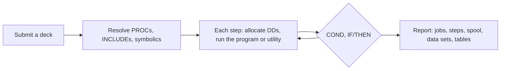

A mainframe has one batch interface: submit JCL against libraries, a catalog, a database and a load library, under a clock. It answers with spool output, return codes and a changed catalog. Harwell keeps that interface.

## The codebase

A codebase runs in place. A `harwell.toml` at its root says what it is: its libraries, its JOB card, its options, its Db2 catalog. Members resolve by member name through declared search orders, as STEPLIB and SYSLIB do:

| Search | Finds |
| --- | --- |
| `procedure_order` | The deck you submit, and every cataloged PROC it calls |
| `search_order` | A step's program and every name it CALLs, earlier library first |
| `copybook_order` | COPY members |
| `system_library` | Site services and load libraries, under their data set names |

Every setting that can change an output byte is resolved once and stamped on the report with its source, under `configuration`. Two runs ran under one configuration exactly when their `configuration.values` match.

## The data

| Data | Where it comes from |
| --- | --- |
| Data sets | One file per DSN, with its geometry (LRECL, RECFM). Fixed-length records have no newlines |
| Db2 tables | The DDL and seed members `db2_catalog` lists, built before a run that starts from no saved state |
| A saved state | A snapshot or a kept volume from an earlier run |

The report's `start_state` says which one the run started on, with a digest.

## The run

- **The clock.** The run clock is the whole system clock. Every date and time a program reads comes from it, including `WHEN-COMPILED`, and it does not advance. A run repeats byte for byte.
- **Programs.** COBOL compiles in IBM dialect when a step needs it. An unchanged codebase builds once, as a load library is link-edited once.
- **Db2.** A step whose CALL closure reaches `EXEC SQL` runs on the Db2 route, as such steps run under `IKJEFT1B`. A CALLed subprogram with SQL runs on the caller's connection inside the caller's unit of work. COMMIT and ROLLBACK end a unit of work, normal end commits, an abend backs out.
- **Abends.** A program check ends the step S0C7, S0CB or S0C9. The job is flushed and the abnormal DISP fires.
- **Chains.** Several jobs run as a chain, each after the jobs it names, under one clock. A job whose predecessor failed reads `blocked`.

## What it leaves

| Output | Read it as |
| --- | --- |
| The job log | One line per step: step, program, kind, status, return code, what it did |
| The spool | Every SYSOUT data set, the job log and what each step printed, by job, step and DD |
| Data sets and tables | On the volume the run kept, or captured into the report |
| A snapshot | The volume written down as a directory you can read and diff |

Two states compare as codes from a closed set. A mask says what a comparison leaves out, such as the job log's CPU and wall times. An expected end state stated with the run makes the run carry its own verdict.

## Next

- [Online runs](/harwell/online-runs)
- [Fidelity](/harwell/fidelity)
- [The report](/harwell/report)
