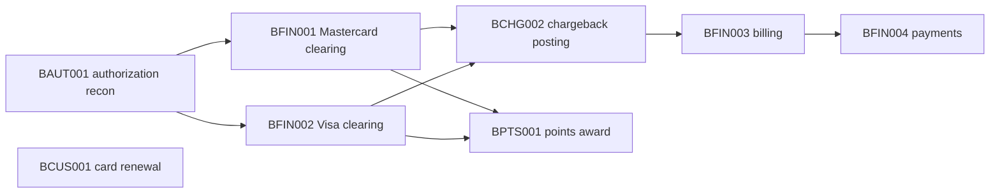

## A credit card payment system

A complete credit card payment platform in COBOL, CICS and Db2, built by a Metaphi mainframe specialist and run on Harwell. Online, it authorizes Mastercard and Visa transactions and manages customers, cards, policies, fraud rules, points, chargebacks and billing on CICS screens. In batch, an end-of-day schedule reconciles authorizations, reconciles network clearing, awards points, bills, applies payments, posts chargebacks and renews cards.

Counted from the repository at commit `feede9c` of its main branch:

| Part | Count |
| --- | --- |
| COBOL main programs | 19: 8 batch, 11 online |
| COBOL subroutines | 31 |
| Copybooks | 34 |
| COBOL lines, programs and subroutines | 15,711 |
| Members with `EXEC SQL` | 42 |
| Db2 DDL members / tables | 8 / 18, plus one seed member |
| JCL decks | 8 |
| BMS mapsets | 9 |
| CICS transactions | 10 |

The end-of-day schedule chains all eight decks. Each runs after the jobs whose output it reads; card renewal depends on none:

Its `harwell.toml` declares the codebase to Harwell: the program search order (main programs, then subroutines), the deck library, the Db2 catalog (eight DDL members and a seed, built before a run that starts from no saved state), and the region's ten transactions.

### How it is verified

| Suite | Kind | What it checks |
| --- | --- | --- |
| Authorization, financial, chargeback, customer, points | Batch, 5 suites | Each deck's reports and output data sets against 16 recorded goldens |
| End to end | Batch, 3 chained legs | One business day: the day's 32 authorization requests, then authorization reconciliation after midnight, then the financial end-of-day chain, each leg on the state the last one left; 9 goldens |
| Authorization, billing, cards, chargeback, customer, fraud, policy | Online, 7 suites | A scripted screen sequence per transaction, 5 to 18 attentions; 3 suites carry a recorded screen oracle |

A screen oracle states the maps a transaction must send and the fields each must show. A golden is the expected bytes of a report or data set.

### Results

{/* RESULTS: pending current run on Harwell */}

## Public reference codebases

Two public applications, pinned to a commit, read by Harwell's own readers with no compiler and no run. Anyone can fetch the same bytes and get the same numbers; CI re-derives them on every push.

| | Repository | Commit | Character |
| --- | --- | --- | --- |
| AWS CardDemo | `aws-samples/aws-mainframe-modernization-carddemo` | `59cc6c2` | Batch-heavy: 61 decks, 62 IDCAMS streams, DFSORT and IEBGENER steps, 21 BMS mapsets, 25 online members, embedded SQL, an IMS variant |
| GenApp | `cicsdev/cics-genapp` | `f6f3f4b` | Online: 500 `EXEC CICS` blocks |

At those commits, on harwell 0.31.0:

| Measure | CardDemo | GenApp |
| --- | --- | --- |
| COBOL members read | 106 | 44 |
| statements | 10,533 | 1,887 |
| text left opaque | 0 | 0 |
| `EXEC CICS` blocks / executed | 240 / 240 | 500 / 500 |
| `EXEC SQL` blocks read and accepted | 33 of 33 | 56 of 56 |
| JCL decks read (refused) | 61 (0) | 29 (0) |
| JCL statements | 2,829 | 786 |
| IDCAMS commands / commands Harwell runs | 102 / 102 | 14 / 14 |
| BMS mapsets / maps / fields | 21 / 21 / 1,166 | 1 / 6 / 279 |
| program members attempted | 44 | 31 |
| **compiled clean** | **31** | **30** |
| refused, each named | 13 | 1 |
| transactions in the region | 30 | 10 |
| of those, naming a program the codebase holds | 24 | 10 |
| **transactions started** (measured by hand) | **16** | **8** |

### What each measure means

| Measure | Means | Does not mean |
| --- | --- | --- |
| Read, accepted | The reader named the statement and left no text opaque | That the statement ran |
| Compiled clean | The member compiled with no diagnostic | That it ran, or ran correctly |
| Transactions started | Started with one attention and nothing typed: the task attached, its first program ran, and it reached a SEND or a RETURN | That the transaction is correct past its first screen |

Transactions started is the one number CI does not re-derive. It was measured by hand, on GnuCOBOL 3.2 without the SQL preprocessor.

### What was refused, and why

| Corpus | Refused | Count |
| --- | --- | --- |
| CardDemo compile | `EXEC DLI`: there is no IMS translator, so the block reaches the compiler untranslated | 5 |
| CardDemo compile | MQ copy members (`CMQ*`) CardDemo does not ship | 3 |
| CardDemo compile | A construct the dialect normaliser does not handle | 3 |
| CardDemo compile | The SQL preprocessor refused the member | 2 |
| GenApp compile | `lgwebst5.cbl`: `PROGRAM-ID. LGWEBST5` has no terminating period | 1 |
| CardDemo start | The first program would not compile | 6 |
| CardDemo start | The transaction's program is in no library of the codebase | 6 |
| CardDemo start | The first program carries `EXEC SQL` and the measuring machine had no SQL preprocessor | 2 |
| GenApp start | The first program would not compile | 1 |
| GenApp start | The task ended before its first SEND or RETURN | 1 |

## What is not measured

- **No conformance result.** IBM does not publish a suite for this platform, and nobody else does either. The public numbers are a corpus sweep.
- **No batch run census on the public codebases.** Neither ships its data in runnable form, so a count of decks that run green would measure the staging, not Harwell.
- **No VSAM, IMS, security or spool sweep.** Neither public codebase carries PL/I, sizeable assembler, Natural, ADABAS, ICETOOL, `JOINKEYS` or a scheduler table; those are covered by unit tests and no public number.
- **No throughput or capacity number.** Nothing measures records per second.

## Next

- [Known limits](/harwell/known-limits)
- [Evaluate Harwell](/harwell/evaluate)
