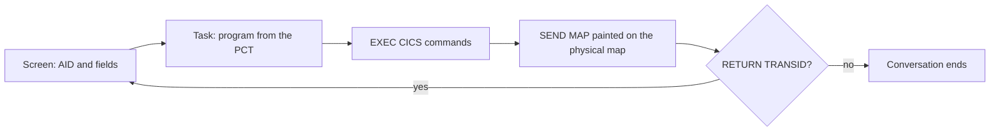

## The region

A region comes from the CSD source the codebase ships, or from a region declared by hand in `harwell.toml`. It carries:

| Table | Holds |
| --- | --- |
| Program control (PCT) | Transaction to program. `RETURN TRANSID` resolves through it |
| File control (FCT) | File name to DSN and cluster geometry, with `recovery`. A CICS file and a batch DD can name the same bytes |
| Transient data (DCT) | Extrapartition, intrapartition (with trigger levels) and indirect queues |
| TS models | Which TS queues are recoverable |

Every program the codebase ships is in the region. Every region also carries CEMT, CECI and CEDF. A definition the region does not carry is named on the report under `cics.csd`.

## A transaction

A transaction starts from the PCT with no deck. The run is given the screens a terminal sends, one per attention key, in order:

- **Translation.** Each `EXEC CICS` block becomes a CALL to a resource manager, as IBM's translator turns it into `CALL 'DFHEI1'`. Condition handling, abend exits and EIBFN follow IBM's tables.
- **Storage.** Every task, LINK and XCTL enters a program on fresh WORKING-STORAGE. Only the COMMAREA or a channel carries state across a turn.
- **Started tasks** run when the terminal is idle, in due-time order, after the task that started them and before the next screen. The clock never moves, so `DELAY` returns at once.
- **One task at a time.** There is no task concurrency or locking.

## Units of work and Db2

A program with both `EXEC SQL` and `EXEC CICS` is preprocessed, translated and compiled once. Its SQL runs on the same database the batch steps use, and the task owns the unit of work:

| CICS | Harwell |
| --- | --- |
| `SYNCPOINT` | Commit; the next unit of work opens |
| `SYNCPOINT ROLLBACK` | Roll back the task's SQL, files and TS queues |
| Task end (`RETURN`) | Commit. One screen turn is one unit of work |
| Abend | The task's uncommitted SQL and recoverable changes are backed out, and the region goes on |
| `EXEC SQL COMMIT` / `ROLLBACK` | Refused with SQLCODE -925 / -926, as Db2 does under CICS |

## Abends

An abend ends the task and the region goes on: an `EXEC CICS ABEND`, a condition no handler takes (`AEIx`), `APCT`, a program check (`ASRA`), a runaway task (`AICA`). The exits run first. Then the unit of work is backed out, DFHAC2236 goes to the job log and DFHAC2206 to the terminal, and the terminal is free for the next transaction. The report records each one under `cics.abends`.

## Screens

Mapsets are assembled from their macro source: the symbolic map as IBM writes it, and the physical map. Each `SEND MAP` is painted on the physical map with BMS's rules: the map supplies position, attribute and initial value, program data replaces it unless it is low-values, and `-1` in a field's length puts the cursor there. The report carries every painted screen.

## The terminal

A person can sit at the transaction: a 3270 emulator (x3270, s3270, c3270, Vista, Galasa) connects over TN3270, the region stays resident, and each key is one task in it. A task that abends ends that task and the region goes on.

A session at the terminal is a case. Its screens become the next run's input, and the turns marked right become the expected screens. Replayed, they give the same maps and the same data.

## Next

- [Fidelity](/harwell/fidelity)
- [The report](/harwell/report)
- [What runs](/harwell/what-runs)
