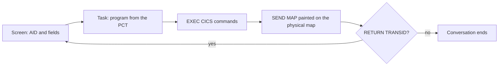

Harwell runs online work as CICS transactions in a region. A transaction starts from the program control table. Its input is the screens that a terminal sends, and its output is the screens that the tasks send, painted on their physical maps.

**Topics**

- [Region](#region)
- [How a transaction runs](#how-a-transaction-runs)
- [Units of work and Db2](#units-of-work-and-db2)
- [Abends](#abends)
- [BMS maps](#bms-maps)
- [3270 terminal access](#3270-terminal-access)
- [Run a CICS transaction](#run-a-cics-transaction)

## Region

Harwell builds the region from the CSD source in your codebase, or from `[site.region]` in `harwell.toml`. The region contains the following tables:

| Table | Content |
| --- | --- |
| Program control table (PCT) | The program for each transaction. `RETURN TRANSID` resolves through it |
| File control table (FCT) | The data set name and cluster attributes for each file, with `recovery`. A CICS file and a batch DD statement can refer to the same data set |
| Destination control table (DCT) | Extrapartition, intrapartition and indirect transient data queues, with trigger levels |
| Temporary storage models | The recoverable temporary storage queues |

Every program in the codebase is available to the region. Every region also provides the CEMT, CECI and CEDF transactions. The report lists any CSD definition that the region does not use in `cics.csd`.

## How a transaction runs

A transaction starts from the PCT. No JCL is required. The run receives the screens that a terminal sends, one for each attention key, in order.

### Translation

Harwell translates each `EXEC CICS` command into a call, as the IBM translator generates `CALL 'DFHEI1'`. Condition handling, abend exits and EIBFN values follow IBM CICS Transaction Server 6.x.

### Storage

Each task, LINK and XCTL enters a program with initialized WORKING-STORAGE. State passes between tasks only through the COMMAREA or a channel.

### Started tasks

A task started by `START` runs when the terminal is idle, in order of due time, after the task that started it and before the next screen. The run clock does not advance, so `DELAY` returns immediately.

### Task concurrency

The region runs one task at a time.

## Units of work and Db2

Harwell preprocesses, translates and compiles a program that contains both `EXEC SQL` and `EXEC CICS` in one pass. Its SQL runs against the same database as the batch steps. The task owns the unit of work:

| Event | Result |
| --- | --- |
| `SYNCPOINT` | Commits. A new unit of work starts |
| `SYNCPOINT ROLLBACK` | Backs out the task's SQL, file and temporary storage changes |
| Task end (`RETURN`) | Commits. Each screen turn is one unit of work |
| Abend | Backs out the task's uncommitted SQL and recoverable changes. The region continues |
| `EXEC SQL COMMIT` or `ROLLBACK` | Rejected with SQLCODE -925 or -926, as Db2 does under CICS |

## Abends

An abend ends the task. The region continues. The following conditions cause an abend:

- An `EXEC CICS ABEND` command
- A condition that no handler takes (`AEIx`)
- A transaction whose program is not available (`APCT`)
- A program check (`ASRA`)
- A runaway task (`AICA`)

Harwell runs the abend exits first. It then backs out the unit of work, writes DFHAC2236 to the job log and sends DFHAC2206 to the terminal. The report records each abend in `cics.abends`.

## BMS maps

Harwell assembles each mapset from its `DFHMSD`, `DFHMDI` and `DFHMDF` macro source into a symbolic map and a physical map. Each `SEND MAP` is painted with BMS rules:

- The physical map supplies the position, attribute and initial value of each field.
- Program data replaces the initial value unless it is low-values.
- A length of `-1` places the cursor in the field.

The report includes every painted screen in `cics.screens_out`.

## 3270 terminal access

A 3270 emulator connects to the region over TN3270. Supported emulators include x3270, s3270, c3270, Vista and Galasa. The region stays resident, and each attention key runs one task. An abend ends that task, and the region continues.

You can record a terminal session as a test case. The screens that you send become the input of the next run, and the turns that you mark as correct become the expected screens. A replay produces the same maps and the same data.

## Run a CICS transaction

**To run a CICS transaction**

1. Declare the region in `harwell.toml`, or include the CSD source in the codebase.
2. List every screen that the user sends, in order, starting with the transaction ID entry.
3. Start the transaction with those screens.
4. In the report, read each screen in `cics.screens_out`, and each abend in `cics.abends`.
5. Check that `cics.terminal_waits` contains no entry with `answered: false`, and that `cics.screens_unread` is absent.

<Note>
`cics.terminal_waits` with `answered: false` means that a task waited for a screen that the input did not supply. `cics.screens_unread` means that the input supplied a screen after the conversation ended.
</Note>

## Related information

- [Batch jobs](/harwell/batch-runs)
- [Run report](/harwell/report)
- [Supported features](/harwell/what-runs#online)
