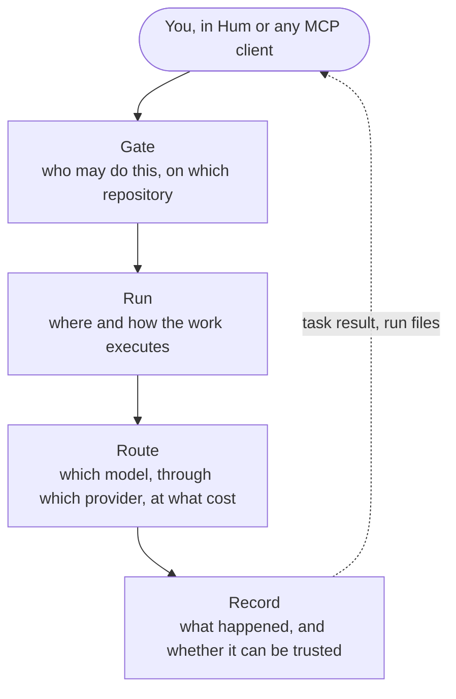
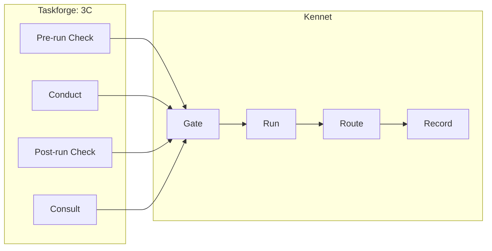

## Four blocks



| Block | Question | What does it |
| --- | --- | --- |
| Gate | Who may do this, on which repository? | One MCP endpoint. Hum sign-in gives you a tier. GitHub decides at every call: a launch needs push, a read needs read. Long work comes back as an MCP task. |
| Run | Where and how does the work execute? | Modal workers: task CI, task runs, authoring, the forge loop, consults. Harbor trials in Modal sandboxes, labelled by run and reaped when it ends. Agent sessions on the Claude Agent SDK. |
| Route | Which model, through which provider, at what cost? | The Nunatak model gateway, for every model call a trial makes. Models are catalog ids. A sandbox holds a short-lived trial token, never a provider key. Each rollout row carries its gateway cost. Judges and authoring sessions call their own provider from the worker. |
| Record | What happened, and can it be trusted? | Your repository's own run volume. One row per rollout. Every failure typed at its source; infrastructure is never scored as a model's 0. |

## 3C on the blocks

Each 3C step is one call, and every call passes through all four blocks.



| Step | Run | Route | Record |
| --- | --- | --- | --- |
| Pre-run Check | Task CI legs, each in its own sandbox | The validate `conduct` leg through the gateway; judged checks call their provider | `<task>/ci/<run id>/`, `<task>/validate/<run id>/` |
| Conduct | k Harbor trials per model | Every trial's model calls | `<task>/eval/<run id>/<model slug>/` |
| Post-run Check | The trajectory reviewer | The judge model, called from the worker | `trajectory_report.json` beside each trial |
| Consult | The asking session, or the Slack thread | The reply agent, called from the worker | The consult record, answers under `<task>/sme/` |

## Gate in detail

- A tier lists the tools you may call. A tool above it is not listed, and a call to it is refused with the tier it needs.
- Whether a call goes through is the owner's answer at the call. For a repository that is GitHub, asked as you.
- A task, a consult or a parked pass is read, listed or cancelled only by the person who started it.

## Record in detail

Runs land on a volume named after the repository (`owner--name`, lowercased), in the task's directory, the bundle directory's last segment:

```
<task>/harbor/                         the bundle as it last ran
<task>/ci/<run id>/                    every task CI check
<task>/validate/<run id>/              every validate
<task>/eval/<run id>/<model slug>/     every run
```

Nothing is overwritten except `harbor/`. Each record names the repository and the commit it ran at.
