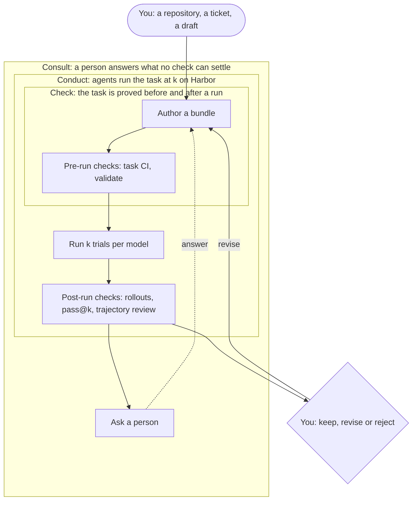

Taskforge turns real work into RL tasks that are calibrated and verified. A task is a Harbor bundle in your repository: an instruction, an environment, a reference solution and a verifier. Taskforge drafts it, proves the verifier, runs agents on it at k and reads every trajectory.

People lead the work. You seed it with a repository, a ticket or a draft. You steer each step and read what it returned. You answer the questions a run asks, and you accept or reject each task. The loop does the drafting, the checking, the running and the reading.

## The 3C loop

Three nested loops, ordered by cost. A check takes minutes, a run at k takes up to an hour, and a question to a person can take days. Most iteration happens inside; the outer loops run only on what survives.

| Step | What it proves | Tools |
| --- | --- | --- |
| Authoring | A candidate is worth building, and the bundle exists | `run_repo_to_tasks`, `run_task_proposals`, `score_candidate`, `generate_harbor_task` |
| Pre-run (Check) | The grader rewards the reference, rejects the untouched code and cannot be gamed | `run_task_ci_checks`, `prerun_validate`, `run_harbor_tasks` mode `validate` |
| Conduct | How real agents do on it, at what cost | `run_harbor_tasks`, `calibrate_task` |
| Post-run (Check) | Each reward was earned, and the task is as hard as you meant | `harbor_rollouts`, `harbor_run_report`, `review_run`, `submit_adjudication` |
| Consult | What only a person knows: a business rule, an intent, a judgment call | `answer_task`, `ask_human` |

Each step is one tool call. You decide the next one from what the last one returned. `run_repo_to_tasks` runs the whole loop for you and still brings its questions to you.

## Where it runs

Taskforge is served from one MCP server, `kennet`, inside [Hum](/overview) or any MCP client. Kennet is the infra under it: sign-in and tiers, Modal workers, Harbor runs, the model gateway and the run volumes. See [Architecture](/taskforge/architecture).

## Next

- [Quickstart](/taskforge/quickstart)
- [Pre-run checks](/taskforge/pre-run)
- [Reference](/taskforge/reference)
